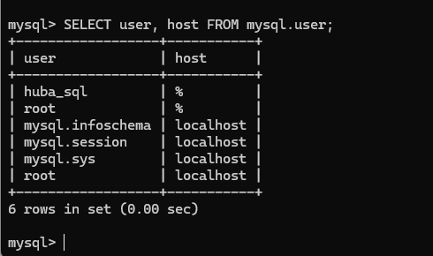
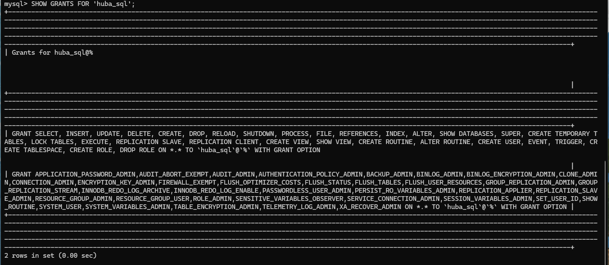
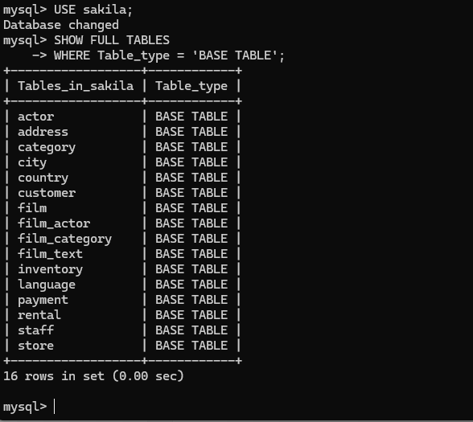
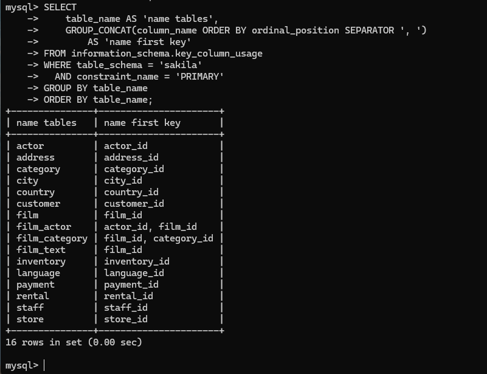

# homework_-DDL-DML-

**Кolesnikov Aleksandr**  

## Задание 1

### 1 Скриншот Список пользователей MySQL
На скриншоте показан результат выполнения SQL-запроса:
SELECT user, host FROM mysql.user;

Данный запрос отображает список пользователей MySQL и хосты, с которых разрешено подключение.
В результате видно созданного пользователя huba_sql, а также системных пользователей MySQL (root, mysql.sys, mysql.session, mysql.infoschema).

### 2 Скриншот Проверка прав пользователя
На скриншоте показан результат выполнения SQL-запроса:
SHOW GRANTS FOR 'huba_sql';
Запрос отображает права, выданные пользователю huba_sql.
Пользователю предоставлены все привилегии (ALL PRIVILEGES) на все базы данных и таблицы с возможностью выдачи прав другим пользователям (WITH GRANT OPTION).

### 3 Скриншот Список таблиц базы данных Sakila
На скриншоте показан результат выполнения команд:
USE sakila;
SHOW FULL TABLES
WHERE Table_type = 'BASE TABLE';

Команды выполняют переход в базу данных sakila и выводят список всех таблиц базы данных.
В результате отображаются таблицы базы данных Sakila, импортированные из дампа.

## Задание 2

### Результат запроса по выводу первичных ключей таблиц базы данных Sakila
На скриншоте показан результат выполнения SQL-запроса:
SELECT
    table_name AS 'name tables',
    GROUP_CONCAT(column_name ORDER BY ordinal_position SEPARATOR ', ')
        AS 'name first key'
FROM information_schema.key_column_usage
WHERE table_schema = 'sakila'
  AND constraint_name = 'PRIMARY'
GROUP BY table_name
ORDER BY table_name;

Запрос выводит список таблиц базы данных sakila и соответствующие им первичные ключи.
Для таблиц с составными первичными ключами отображаются несколько полей.

